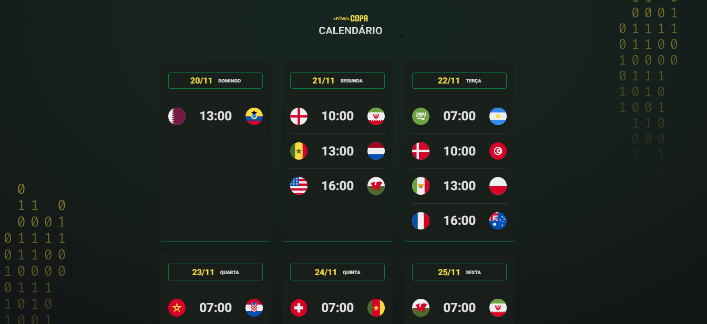
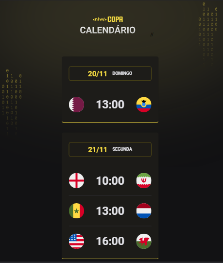

# CALENDÁRIO DA COPA 2022 ⚽🥅🏆

> NLW - Rocketseat 🚀

- VERSÃO WEB - GREEN
  

- VERSÃO MOBILE - YELLOW
  

Durante o evento a proposta foi criar um calendário respondivo da Copa do Mundo de 2022, com cores personalizaveis, dados imseridos de forma 'dinâmica'.

[Clique aqui para acessar!!👈](https://tiemi9.github.io/NLW-Copa.2022/)

## 📡 Tecnologias

- HTML,
- CSS,
- JavaScript,
- Git e GitHub

## 💻 Contato

https://www.linkedin.com/in/cristiemim9

### 🎉 Agradecimentos

##### À toda equipe da Rocketseat, e principalmete ao Mayk Britto que nos acompanhou durante esse evento incrível, cheio de novidades, e muito aprendizado. Pode ser dificil, mas não impossível, e com certeza o Mayk torna tudo mais fácil!! Valeu Maikão!! Daqui para frente, só quero embarcar nesse foguete! 🚀
